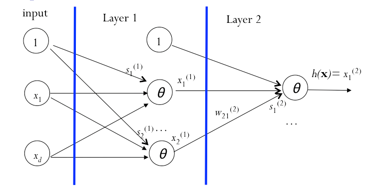
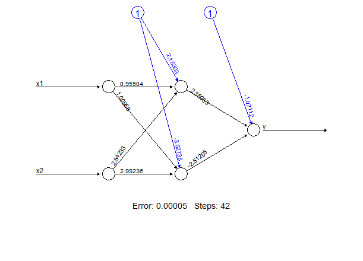

# Question 1

*A scoring function (classifier) assigned scores for 10 positive data points and 10 negative ones as follows:*

```{r, echo=FALSE}
scores <- read.csv("C:\\Repositories\\MachineLearning\\Homework2\\scores.csv", stringsAsFactors = FALSE)
library(knitr)
kable(scores)
```

*Compute FPR and TPR for each score threshold in 3, 4, 5, 6, 7, 8, 9, 10, and plot the ROC curve of the scoring function (25 points).*

# Answer 1

Below is a histogram for the assigned scores.

```{r, echo=FALSE, message=FALSE}
library(ggplot2)
ggplot(scores, aes(Score, fill = Label)) + geom_histogram(alpha = 0.5, aes(y = ..density..), position = 'identity')
```

Looking at the densities, it appears that Negative has lower scores than Positive. If we choose 3 as the cutoff ($\leq 3$ is Negative, $>3$ is Positive), then we get the table below (the column headers indicate the target function and the first column indicates the outcome function).


|    |  +1 |  -1
|----+-----+----
| +1 |   2 |   0
| -1 |   8 |  10

The false positive rate is $\frac{0}{0+10}=0$ and the true positive rate is $\frac{2}{2+10}=0.2$.

If 4 is the cutoff:

|    |  +1 |  -1
|----+-----+----
| +1 |   2 |   1
| -1 |   8 |  9

$FPR=\frac{0}{0+10}=0$ and $TPR=\frac{2}{2+10}=0.2$.

For all of the cutoffs, we get the following table and ROC curve:

\pagebreak

| Score    |  TP |  P  | TPR |  FP | N  | FPR
|----------+-----+-----+-----+-----+----+----
| $\leq 10$ |  10 |  10 | 1   | 10  | 10 | 1
| $\leq 9$ |  10 |  10 | 1   |  8  | 10 | 0.8
| $\leq 8$ |  10 |  10 | 1   |  6  | 10 | 0.6
| $\leq 7$ |  10 |  10 | 1   |  2  | 10 | 0.2
| $\leq 6$ |   7 |  10 | 0.7 |  2  | 10 | 0.2
| $\leq 5$ |   4 |  10 | 0.4 |  2  | 10 | 0.2
| $\leq 4$ |   2 |  10 | 0.2 |  1  | 10 | 0.1
| $\leq 3$ |   2 |  10 | 0.2 |  0  | 10 | 0

```{r, echo=FALSE, message=FALSE}
library(ROCR)
pred <- prediction(scores$Score, scores$Label)
perf <- performance(pred,"tpr","fpr")
plot(perf)
```

# Question 2

*The abundance of a protein follows a normal distribution* $f(x)=\frac{1}{\sqrt{2\pi}}e^{-\frac{(x-\theta)^{2}}{2}}$. *Four measurements reported the following abundance values:  10, 13, 17, and 18. Use the maximum likelihood estimation method to estimate the value for parameter $\theta$. (25 points)*

# Answer 2

$$f(x; \theta)=\frac{1}{\sqrt{2\pi}}e^{-\frac{(x-2)^{2}}{2}}$$

$$L(\theta)=\prod_{i=1}^{n}f(x_{i}; \theta)=\frac{1}{(\sqrt{2\pi})^{n}}e^{-\frac{1}{2}\sum(x_{i}-\theta)^2}$$

$$ln(L(\theta))=-\frac{n}{2}log(2\pi)-\frac{1}{2}\sum(x_{i}-\theta )^{2}$$

$$\frac{\partial (ln(L\theta))}{\partial \theta}=0-\frac{1}{2}2\sum (x_{i}-\theta)(-1)=0 $$

$$\sum x_{i} -n\theta = 0 => \theta = \frac{1}{n}\sum x_{i}$$

The maximum likelihood estimate of theta is $\frac {10+13+17+18}{4}=4.5$.

# Question 3

*In an experiment, the relationship between age, cholesterol level and signs of heart disease was studied. The data of five people was acquired (see the following table).*
 
```{r, echo=FALSE}
hdisease <- read.csv("C:\\Repositories\\MachineLearning\\Homework2\\hdisease.csv", stringsAsFactors = FALSE)
library(knitr)
kable(hdisease)
```

*Please use R to do logistic regression using the data set. Please give the commands, report the final weights, and plot the logistic function (25 points).*

# Answer 3
The table above was read into R as a `data.frame` named `hdisease`. Below I fit a model for each  explanatory variable.

```{r}
fit.chol <- glm(Sign.of.heart.disease ~ Cholesterol.level, hdisease, family=binomial("logit"))
fit.age <- glm(Sign.of.heart.disease ~ Age, hdisease, family=binomial("logit"))
```
Below are the summaries.

```{r}
fit.chol
fit.age
```

Below are the regression curves.

```{r, fig.width=5, fig.height=4, fig.align='center'}
plot(hdisease$Cholesterol.level,hdisease$Sign.of.heart.disease)
curve(plogis(coef(fit.chol)[1] + coef(fit.chol)[2]*x),add=TRUE) 
plot(hdisease$Age, hdisease$Sign.of.heart.disease)
curve(plogis(coef(fit.age)[1] + coef(fit.age)[2]*x),add=TRUE)
```

Age appears to be a better discriminator. The weights are
```{r}
coef(fit.age)
```

# Quesion 4

*The following neural network is trained using the back propagation algorithm.*



*The data points in the training data set are*

$x_{1}$  | $x_{2}$ |  y
-------- | ------- | ---
 -3      |   1      |  1
  3      |   1      | -1
  3      |  -1      |  1
 -3      |  -1      | -1


 
*Please use R to train the neural network. Please give the commands, report the final weights, and plot the neural network (25 points).*

# Answer 4
First I train the network using the `neuralnet()` function.
```{r, message=FALSE}
library(neuralnet)
network <- read.csv("C:\\Repositories\\MachineLearning\\Homework2\\network.csv", 
                    stringsAsFactors = FALSE)
nn <- neuralnet(y ~ x1 + x2, data=network, hidden=2, err.fct="sse") 
```
Below are the results.
```{r}
nn$result.matrix
```

Below is the plot of the network.

```{r, eval=FALSE}
plot(nn) 
```
